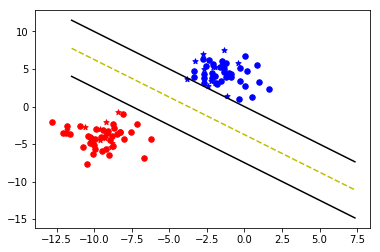

## Approach

1. Created a class named Support_Vector_Machine with 3 methods:
      - fit
      - predict
      - visualize

2. Generated a binary class toy dataset having 100 data points using make_blobs from sklearn.

3. Splitted the dataset into training and testing data.

4. Converted the training dataset into dictionary in such a way that with key as -1, values are negative class samples and with key as +1, values are positive class samples.

5. Predicted the classes of test data and visualized the svm,by using the methods predict and visualize respectively.And visualization results were like:
          
        
        

6. Compared with predicted results of svm from sklearn.

## More into the Support_Vector_Machine class

In method fit,we have a constraint i.e. yi*(xi*w+b) >= 1 that should be satisfied by each observation, checked the possible values of w and b against it with given observation xi and correspondingly updated the value of w with varying step size (in the order 0.1,0.01,0.001 times the max_feature value).So this method eventually optimized w and b.The method predict simply predict the classes of given data using the optimized w and b calculated from the fit method.The visualize method is there for our convenince.It helps us to visualise the hyperplane and margins learned by the model. 

